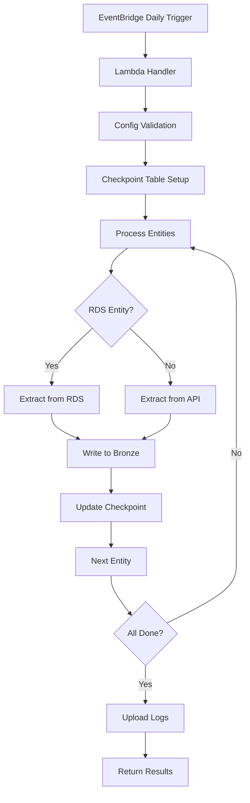

# Bronze Ingestion Pipeline

## Overview

The bronze ingestion pipeline is a daily AWS Lambda-based data pipeline that extracts raw data from source systems and lands it in the bronze tier of the medallion data lake architecture. The pipeline supports both full and incremental loads, maintaining state across runs for efficient data processing.

## Architecture

### Components

1. **AWS Lambda Function** (`ingestion/lambda_handler.py`)
   - Main entry point triggered daily via EventBridge
   - Orchestrates extraction, state management, and bronze writing
   - Handles error recovery and log uploads

2. **Data Extraction Modules**
   - `extract/rds_reader.py`: Extracts data from PostgreSQL RDS using updated_at timestamps
   - `extract/api_client.py`: Calls payments and shipments APIs with incremental filtering

3. **State Management** (`state/store.py`)
   - DynamoDB-based checkpointing for incremental loads
   - Tracks last sync timestamps per entity

4. **Bronze Writer** (`bronze/writer.py`)
   - Writes Parquet files to S3 with proper partitioning
   - Adds metadata for change detection and lineage

5. **Infrastructure** (`infrastructure/ingestion/ingestion_stack.py`)
   - CDK stack defining Lambda, IAM roles, EventBridge scheduling
   - CloudWatch monitoring and alerting

## Data Flow



## Partitioning Strategy

### Bronze Tier Structure
```
s3://aws-ecom-pipeline/data/bronze/{entity}/
├── ingestion_date=2024-01-15/
│   ├── load_type=full/
│   │   └── event_date=2024-01-14/
│   │       ├── part-00000.parquet
│   │       └── part-00001.parquet
│   └── load_type=incremental/
│       └── event_date=2024-01-14/
│           └── part-00000.parquet
```

### Partition Keys

- **ingestion_date**: Date when data was ingested (YYYY-MM-DD)
- **load_type**: 'full' or 'incremental'
- **event_date**: Business date of the data (when available)

### Rationale

1. **Time-based partitioning** enables efficient querying by ingestion time and business time
2. **Load type separation** allows distinguishing between full refreshes and incremental updates
3. **Event date partitioning** supports business logic queries and time-travel analysis
4. **Hierarchical structure** optimizes S3 listing and Athena queries

## Incremental Logic

### Checkpoint Management

- **Storage**: S3 file `logs/pipeline/ingestion/checkpoints.json`
- **Structure**: JSON object with entity names as keys
- **Fields per entity**:
  - `last_sync_timestamp`: ISO format timestamp
  - `record_count`: Records processed in last run
  - `updated_at`: Checkpoint update time

**Example checkpoint file:**
```json
{
  "customers": {
    "last_sync_timestamp": "2024-01-15T10:30:00",
    "record_count": 1500,
    "updated_at": "2024-01-15T10:35:00"
  },
  "orders": {
    "last_sync_timestamp": "2024-01-15T10:32:00",
    "record_count": 250,
    "updated_at": "2024-01-15T10:35:00"
  }
}
```

### Incremental Queries

#### RDS Entities
```sql
SELECT * FROM {entity}
WHERE updated_at >= '{last_sync_timestamp}'
ORDER BY updated_at ASC
```

#### API Entities
- Primary: `GET {endpoint}?since={timestamp}`
- Fallback: Client-side filtering after full extraction

### First Run Behavior

- Sets `last_sync_timestamp` to `1970-01-01 00:00:00`
- Performs full data extraction
- Creates initial checkpoints

## Metadata & Change Detection

### Bronze Record Schema

Each bronze record includes:

- **Original fields**: Preserved as-is from source
- **_ingestion_ts**: UTC timestamp when data was ingested
- **_source_system**: 'rds' or 'api'
- **_record_hash**: MD5 hash of original record for change detection
- **_ingestion_id**: Unique UUID for this ingestion operation

### Change Detection

```python
# Generate record hash for comparison
record_str = str(sorted(record.items()))
record_hash = hashlib.md5(record_str.encode()).hexdigest()
```

## Monitoring & Observability

### CloudWatch Metrics

- **Errors**: Lambda function errors (alerts configured)
- **Duration**: Execution time (alerts for >13 minutes)
- **Invocations**: Daily run tracking

### Logging

#### CloudWatch Logs
- Real-time streaming to `/aws/lambda/{function_name}`
- 30-day retention period


#### Log Format
```
[2024-01-15 10:30:45] Starting: Configuration Validation
[2024-01-15 10:30:45] Completed: Configuration Validation
[2024-01-15 10:31:20] Starting: Processing customers
[2024-01-15 10:31:25] Processing customers: Extracted 1500 records
[2024-01-15 10:31:30] Completed: Processing customers
```

## Configuration

### Environment Variables

| Variable | Required | Description |
|----------|----------|-------------|
| `S3_BUCKET_NAME` | Yes | Target S3 bucket |
| `RDS_SECRET_ARN` | Yes | Secrets Manager ARN containing host, port, database, username, and password |
| `PAYMENTS_API_URL` | Yes | Payments API endpoint |
| `API_KEY_SECRET_ARN` | Yes | ARN of Secrets Manager secret containing API keys |
| `LOAD_TYPE` | No | FULL or INCREMENTAL (default: INCREMENTAL) |
| `PAYMENTS_API_SECRET_NAME` | No | Optional. When set, API stack reuses the named Secrets Manager secret (for example `ecom-payments-api-key`) instead of creating a new one. |

### API Key Management
The API keys are securely managed via AWS Secrets Manager:

- **API Stack**: Creates a new secret (with an auto-generated name) containing a secure 48-character alphanumeric key, or reuses the secret specified by `PAYMENTS_API_SECRET_NAME` (for example `"ecom-payments-api-key"`). If you decide to manage the secret yourself, ensure the `api_key` value is **alphanumeric** and at least **20 characters** to satisfy API Gateway’s requirements.
- **API Gateway**: Uses the secret value for API key authentication
- **Lambda APIs**: Retrieve the key from Secrets Manager for request validation
- **Ingestion Stack**: Retrieves the same key from Secrets Manager for API calls

### IAM Permissions

The Lambda execution role requires:

```json
{
  "Version": "2012-10-17",
  "Statement": [
    {
      "Effect": "Allow",
      "Action": [
        "s3:GetObject",
        "s3:PutObject",
        "s3:ListBucket",
        "s3:HeadObject"
      ],
      "Resource": [
        "arn:aws:s3:::aws-ecom-pipeline",
        "arn:aws:s3:::aws-ecom-pipeline/*"
      ]
    },
    {
      "Effect": "Allow",
      "Action": [
        "secretsmanager:GetSecretValue"
      ],
      "Resource": [
        "arn:aws:secretsmanager:*:*:secret:ecom-rds-*",
        "arn:aws:secretsmanager:*:*:secret:ecom-payments-api-key*"
      ]
    },
    {
      "Effect": "Allow",
      "Action": [
        "lambda:InvokeFunction"
      ],
      "Resource": "arn:aws:lambda:*:*:function:*"
    }
  ]
}
```

## Operational Procedures

### Manual Execution

```bash
# Full load
aws lambda invoke --function-name EcomIngestionStack-IngestionFunction \
  --payload '{"load_type": "FULL"}' output.json

# Incremental load (default)
aws lambda invoke --function-name EcomIngestionStack-IngestionFunction \
  --payload '{}' output.json
```

### Monitoring Queries

#### Recent Ingestion Runs
```sql
SELECT *
FROM "aws-ecom-pipeline"."logs/pipeline/ingestion"
WHERE date > current_date - interval '7' day
ORDER BY date DESC, time DESC
```

#### Bronze Data Counts
```sql
SELECT
  ingestion_date,
  load_type,
  entity,
  COUNT(*) as record_count
FROM "aws-ecom-pipeline"."data/bronze"
GROUP BY ingestion_date, load_type, entity
ORDER BY ingestion_date DESC
```

### Troubleshooting

#### Common Issues

1. **RDS Connection Timeout**
   - Check VPC configuration and security groups
   - Verify Lambda has VPC access to RDS

2. **API Rate Limiting**
   - Check API usage plans and throttling
   - Implement exponential backoff in API client

3. **DynamoDB Throttling**
   - Monitor read/write capacity
   - Consider provisioned throughput for high-frequency runs

4. **S3 Permissions**
   - Verify bucket policies and IAM roles
   - Check encryption settings

#### Error Recovery

- **Failed Entity**: Pipeline continues with other entities
- **Full Failure**: Check CloudWatch logs and S3 logs
- **State Corruption**: Manually update DynamoDB checkpoints
- **Data Quality**: Use Athena to validate bronze data

## Performance Considerations

### Optimization Strategies

1. **Parallel Processing**: Entities processed sequentially (can be parallelized)
2. **Batch Writing**: awswrangler optimizes S3 multipart uploads
3. **Compression**: Snappy compression for Parquet files
4. **Memory Management**: 2GB allocated for data processing

### Scaling Limits

- **Lambda Timeout**: 15 minutes maximum
- **Memory**: 2GB allocated (can increase if needed)
- **Payload Size**: API Gateway 6MB limit (Lambda direct invoke higher)

## Future Enhancements

1. **Parallel Entity Processing**: Process multiple entities concurrently
2. **Advanced Incremental Logic**: Support for composite keys and soft deletes
3. **Data Quality Checks**: Schema validation and statistical profiling
4. **Workflow Orchestration**: Step Functions for complex dependencies
5. **Cost Optimization**: Provisioned concurrency for predictable loads
